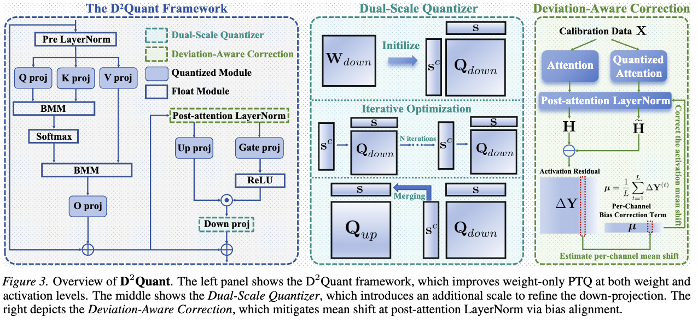
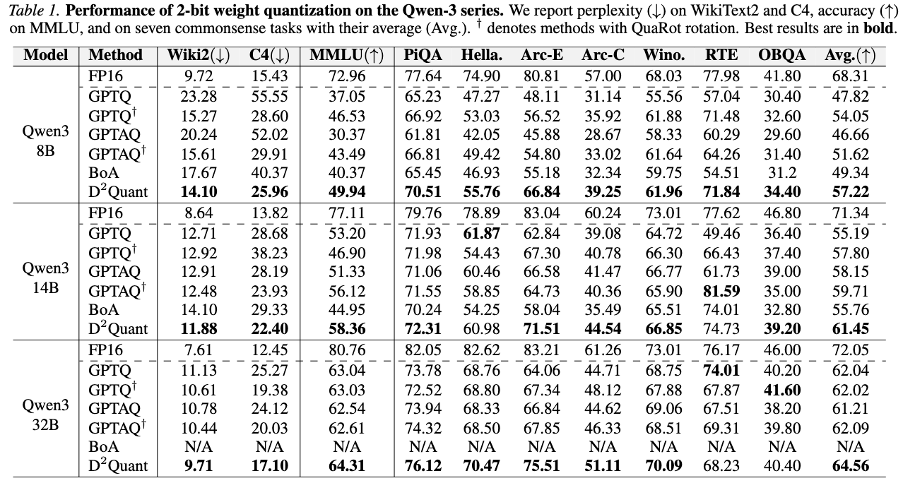
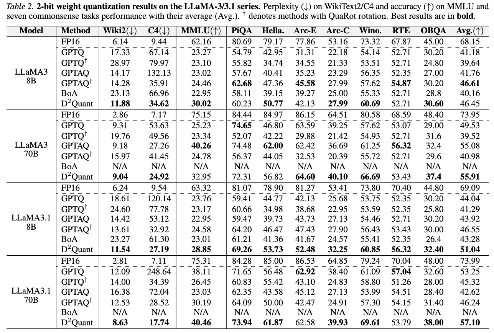

#  D<sup>2</sup>Quant: Accurate Low-bit Post-Training Weight Quantization for LLMs

<p align="center">
  <a href="">
    
  </a>
  <a href="https://github.com/XIANGLONGYAN/D2Quant/releases/tag/paper">
     -->
  </a>
  <a href="[https://github.com/XIANGLONGYAN/D2Quant]">
    
  </a>
</p>

[Xianglong Yan](https://xianglongyan.github.io/), Chengzhu Bao, [Zhiteng Li](https://zhitengli.github.io), [Tianao Zhang](https://zta20040910.github.io/), [Haotong Qin](https://htqin.github.io/), [Shaoqiu Zhang](https://qiushao-e.github.io/) [Ruobing Xie](https://ruobingxie.github.io/), Xingwu Sun, and [Yulun Zhang](http://yulunzhang.com/), "D²Quant: Accurate Low-bit Post-Training Weight Quantization for LLMs", arxiv, 2026

#### 🔥🔥🔥 News

- **2026-1-30:** This repo is released.

---

> **Abstract:** Large language models (LLMs) deliver strong performance, but their high compute and memory costs make deployment difficult in resource-constrained scenarios. Weight-only post-training quantization (PTQ) is appealing, as it reduces memory usage and enables practical speedup without low-bit operators or specialized hardware. However, accuracy often degrades significantly in weight-only PTQ at sub-4-bit precision, and our analysis identifies two main causes: (1) down-projection matrices are a well-known quantization bottleneck, but maintaining their fidelity often requires extra bit-width; (2) weight quantization induces activation deviations, but effective correction strategies remain underexplored. To address these issues, we propose D$^2$Quant, a novel weight-only PTQ framework that improves quantization from both the weight and activation perspectives. On the weight side, we design a Dual-Scale Quantizer (DSQ) tailored to down-projection matrices, with an absorbable scaling factor that significantly improves accuracy without increasing the bit budget. On the activation side, we propose Deviation-Aware Correction (DAC), which incorporates a mean-shift correction within LayerNorm to mitigate quantization-induced activation distribution shifts. Extensive experiments across multiple LLM families and evaluation metrics show that D$^2$Quant delivers superior performance for weight-only PTQ at sub-4-bit precision. The code and models will be available at https://github.com/XIANGLONGYAN/D2Quant. 



---

## ⚒️ TODO

* [ ] Complete this repository

## 🔗 Contents

- [ ] Post-training quantization
- [ ] Models
- [x] [Results](#Results)
- [x] [Citation](#Citation)
- [x] [Acknowledgements](#Acknowledgements)

## 🔎 Results

<details>
<summary>D<sup>2</sup>Quant demonstrates superior performance on the Qwen-3 model series under 2-bit weight-only quantization. (click to expand) (click to expand)</summary>
<p align="center">
  
</p>

</details>

<details>
<summary>D<sup>2</sup>Quant demonstrates superior performance on the LLaMA-3 and LLaMA-3.1 model series under 2-bit weight-only quantization. (click to expand)</summary>
<p align="center">
  
</p>

</details>

## Citation

If you find the code helpful in your research or work, please cite the following paper.

```

```

## 💡 Acknowledgements

This work is released under the Apache 2.0 license.
